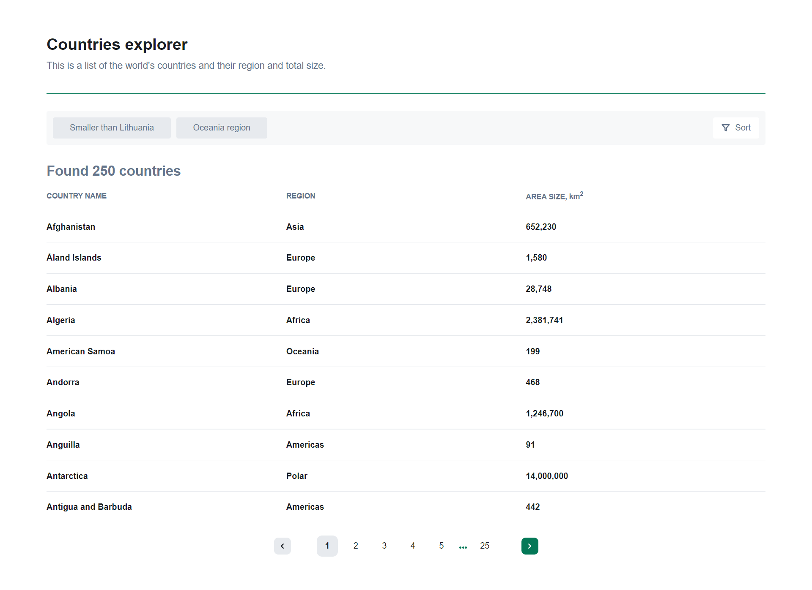
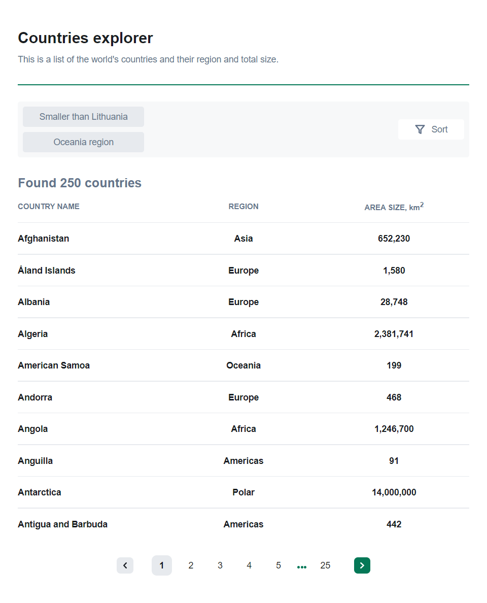
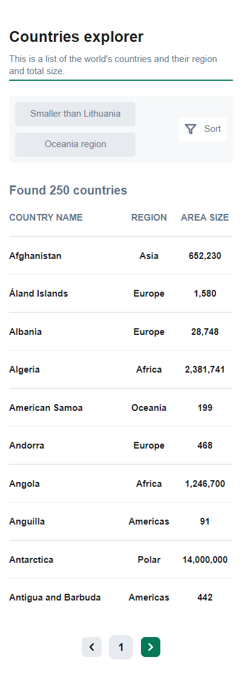

# Countries Explorer - single-page application with a list of countries from [REST Countries API](https://restcountries.com/)

This is a list of the world&apos;s countries and their region and total size.

## Table of contents

- [Link](#link)
- [The assignment](#the-assignment)
- [Built with](#built-with)
- [Screenshot](#screenshot)
---
### Link
The project has been successfully deployed and is currently hosted on <u>[Vercel](https://vercel.com/)</u>, a cloud platform for static sites.

<u>[Link to the project](https://countries-explorer-nine.vercel.app/)</u>
### The assignment

The assignment includes:

- Display a list of the countries from the **API** on the homepage;
- **Sort** the list **alphabetically** by name (ascending, descending);
- Implement **filters** that filter countries:
  - That are smaller than **Lithuania** by area;
  - That are in **“Oceania”** region;
- Implemented **pagination**;

### Built with

- Semantic **HTML5** markup
- **CSS**
- **Responsive layout** using media queries, flexbox and CSS Grid
- **React.Js** library
- Routing with **React Router**
- **Redux** state management
- **Typescript** for type manipulation
### Screenshot
- **1400px**

- **768px**

- **320px**

